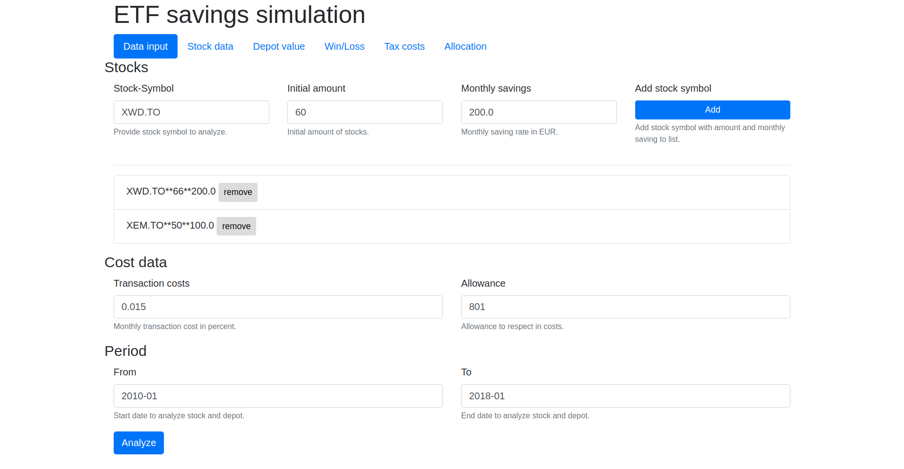
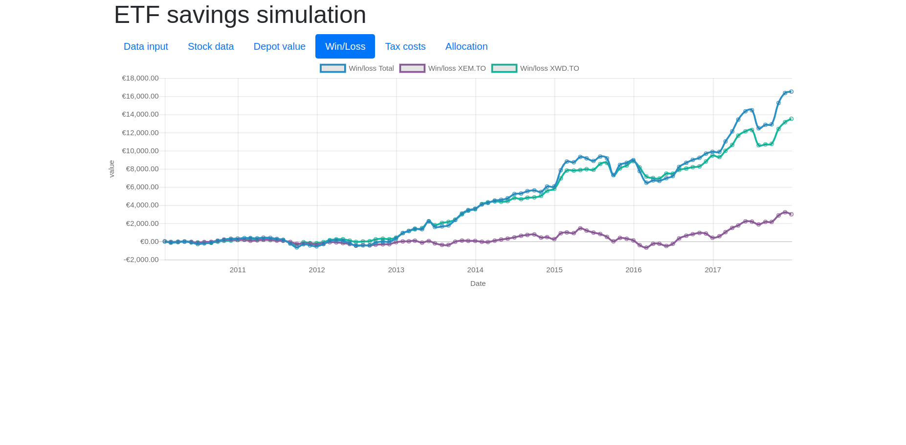

[](https://goreportcard.com/report/github.com/windler/etf-dash) [](https://codebeat.co/projects/github-com-windler-etf-dash-master)


# etf-dash
Stock api and dashboard for stock (etf) simulations. Its main purpose was to get a idea how an etf portfolio will progress over time and visualize compounded interest.

# Installation
```bash
go get -u github.com/windler/etf-dash
```

# Usage
`etf-dash` bases on [alphavantage-api](https://www.alphavantage.co/). Therefore, you need an api key. If no key is provided the `demo` key is used. After obtaining a key, start the api server via (assuming etf-dash is in your `$PATH`)

```bash
etf-dash -apiKey="YOUR_API_KEY"
```

This will start a webserver listening on `:1234`.

#Dashboard

You can access a dashboard via `localhost:1234`.




# JSON-api
Via `localhoist:1234/getData` you can access the JSON-api.
The request payload follows the following structs:

```go
type GetDataRequest struct {
	Savings                   []stockdata.MonthlySaving `json:"savings"`
	Allowance                 float64                   `json:"allowance"`
	TransactionCostPercentage float64                   `json:"transactionCostPercentage"`
	From                      string                    `json:"from"`
	To                        string                    `json:"to"`
}
```

```go
type MonthlySaving struct {
	Symbol        string  `json:"symbol"`
	InitialAmount float64 `json:"initialAmount"`
	Saving        float64 `json:"monthlySavings"`
}
```

# Data
Tax calculation are based on german tax law (2018). There is no guarantee that any of the calculated data is correct.